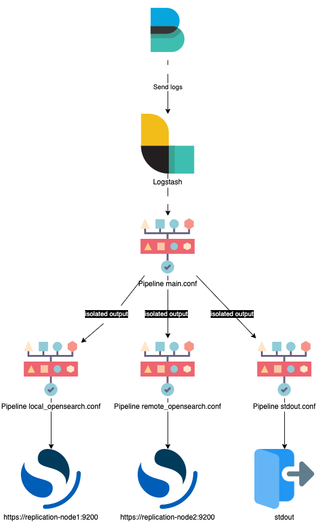

# logstash-pipeline-to-pipeline-example

This repo is logstash pipeline-to-pipeline communication.
Case: We need send logs from beats in to different clusters opensearch\elasticsearch.
This is config resolve logstash output blocking problem, like this [link to overflow](https://stackoverflow.com/questions/65420997/what-happens-if-one-of-logstash-output-is-not-available)

You need to POST data into logstash:8880 for learning this example.

## Architecture

